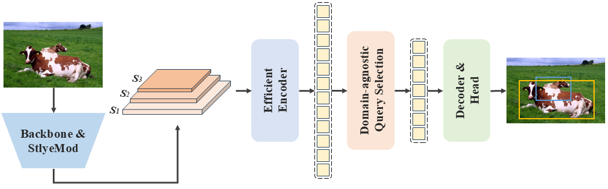

# DG-DETR

## Network Architecture
 

## Installation
```
conda create -n DG-DETR python=3.10  # create a virtual env
pip install -r requirements.txt     # install other needed packages
```

## Datasets Preparation

## Test

Run the following script to test the trained model:

```sh
tools/train.py -c configs/rtdetr/rtdetr_r50vd_6x_coco.yml -r path/to/checkpoint --test-only
```

## Performance

## TODO list
- [x] Add instructions
- [ ] Add test code
- [ ] Add checkpoint files
- [ ] Add training code

## Citation

## Acknowledgement
Thanks to Yuda Song et al for releasing their official implementation of the [RT-DETR](https://openaccess.thecvf.com/content/CVPR2024/html/Zhao_DETRs_Beat_YOLOs_on_Real-time_Object_Detection_CVPR_2024_paper.html) paper. Our code is heavily borrowed from the implementation.
